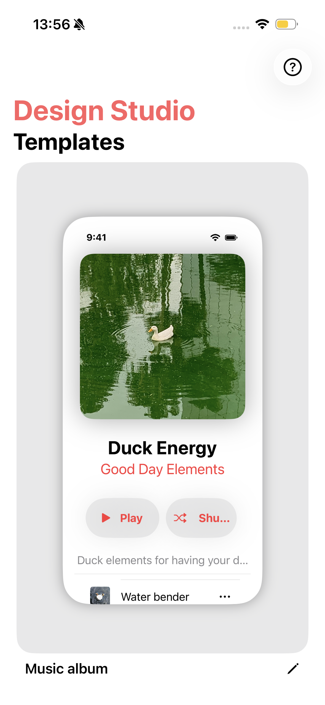
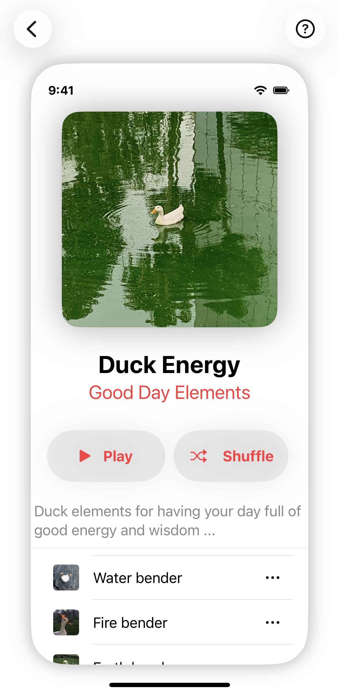
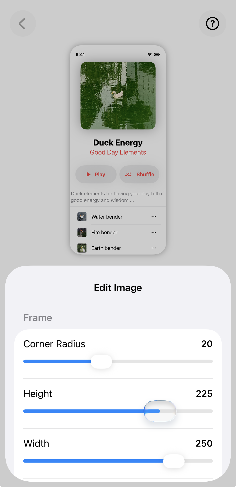
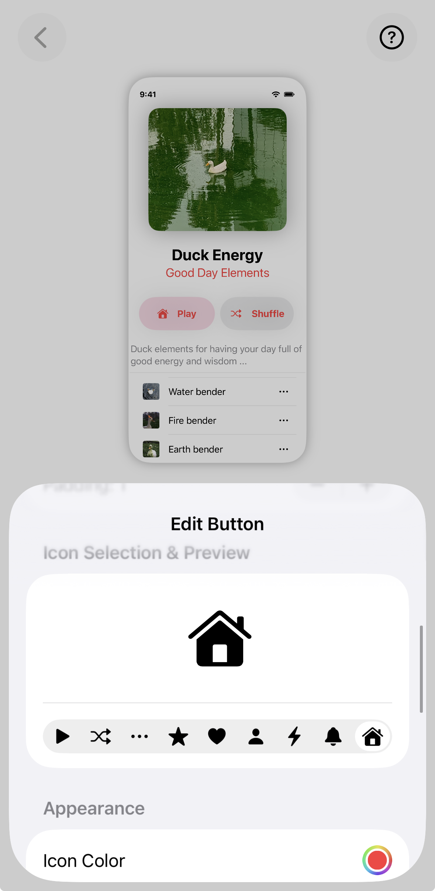
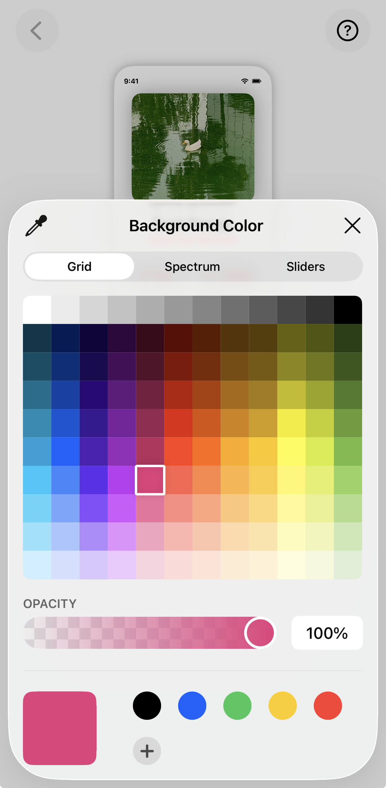

# Deswift UI

Deswift UI is an iOS app built with Xcode designed to help understand the UI elements of the user interfaces and their adherence to design and human interface principles

## Features
- See template of Apple Music album view
- Modify UI elements of template in Design Editor View
- See key Human Interface Guidelines in Learn More View

## Installation
1. Clone this repository: `git clone <https://github.com/J-C-1020/Deswift-UI.git`>
2. Open the project in Xcode.
3. Run the app on a simulator or connected device (iOS device).

**App Views**

## Credits
- [Human Interface Guidelines](https://developer.apple.com/design/human-interface-guidelines#Hierarchy)

**List Images**
- [Air Duck image](https://pin.it/17ygREsNL)
- [Fire Duck image](https://pin.it/17ygREsNL)
- [Water Duck image](https://pin.it/3WnB41tAO)
- [Earth Duck image](https://pin.it/3WnB41tAO)
